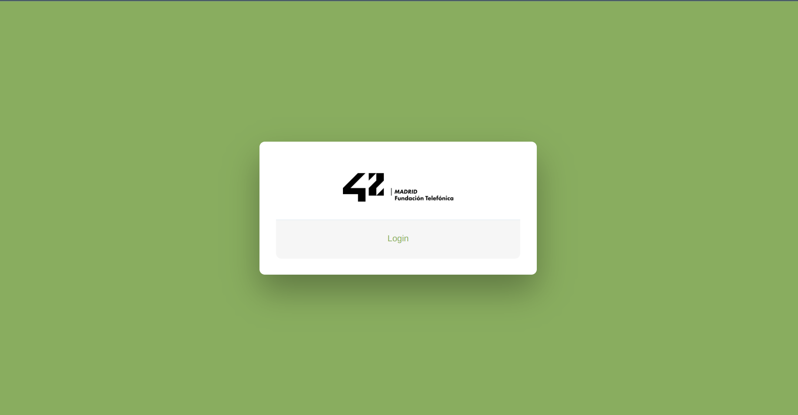
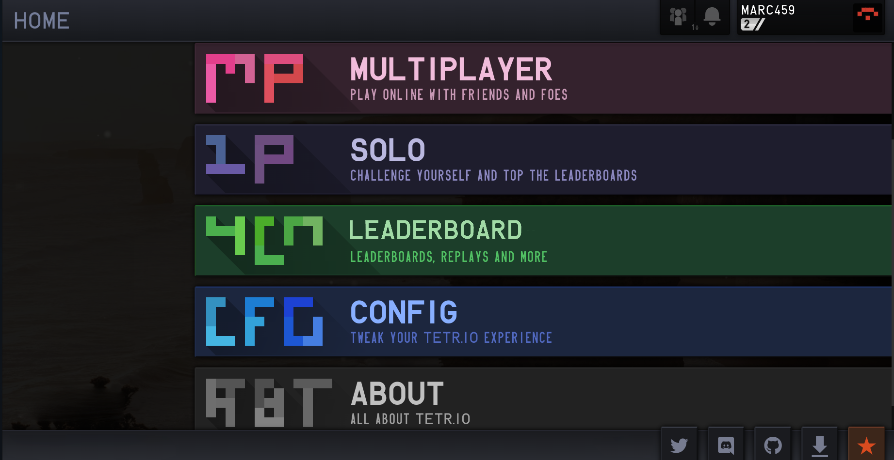
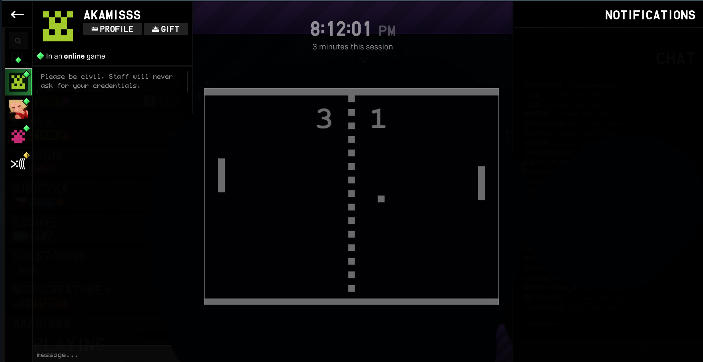
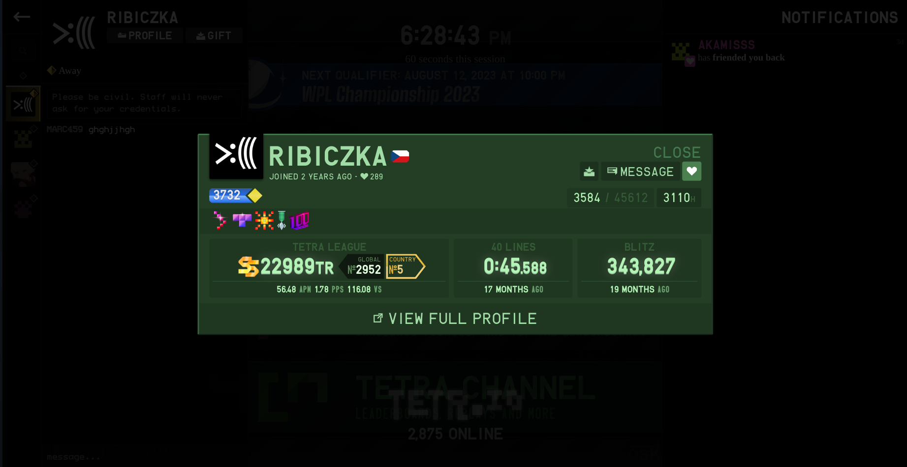
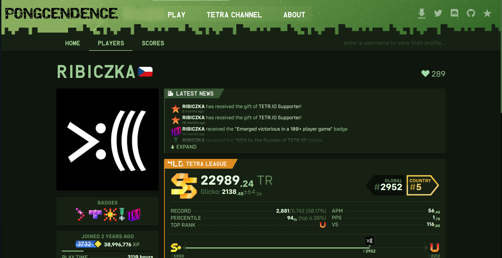

# TRASCENDENCE LOGIN

### HOW TO RUN

    make

### DESIGN

#### LOGIN

#### MENU

#### CHAT

#### PROFILE

#### FULLPROFILE

### BIBLIOGRAPHY

https://programacionymas.com/blog/jwt-vs-cookies-y-sesiones

https://github.com/sveltejs/vite-plugin-svelte/blob/main/docs/faq.md#where-should-i-put-my-global-styles
